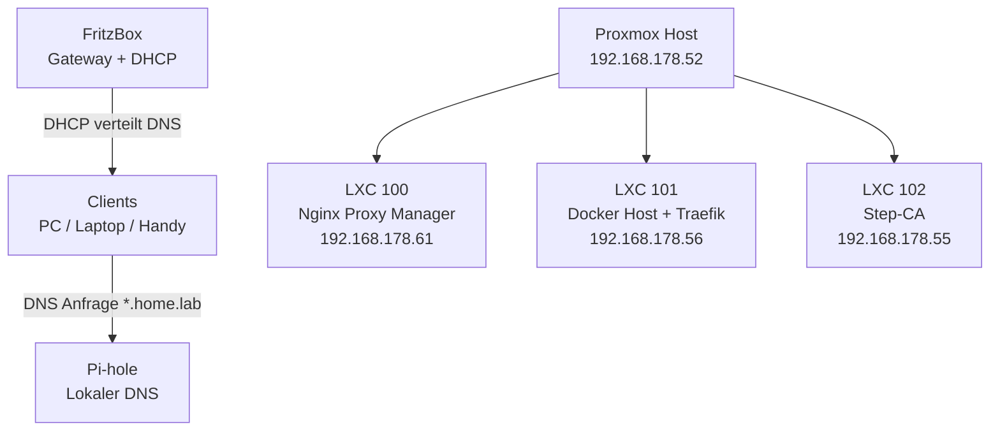
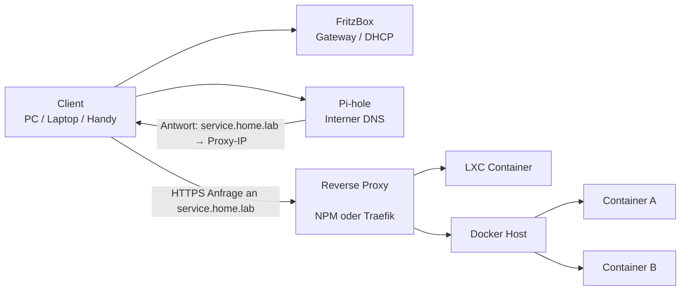
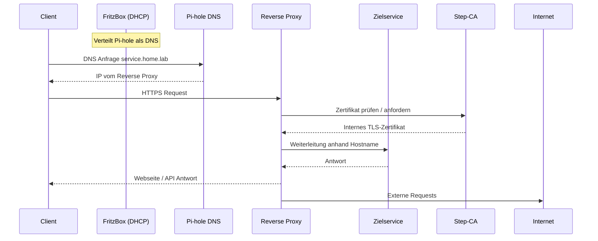

# 🏠 Homelab Infrastructure

Dokumentation und Konfiguration meines privaten Homelabs.

Dieses Repository dient dazu, die gesamte Infrastruktur nachvollziehbar zu dokumentieren, Versionen zu verwalten und das Setup reproduzierbar zu machen.

---

## Inhaltsverzeichnis

- [Überblick](#überblick)
- [Architektur](#architektur)
- [Netzwerkstruktur](#netzwerkstruktur)
- [Namensauflösung (DNS)](#namensauflösung-dns)
- [Reverse Proxy Struktur](#reverse-proxy-struktur)
- [Host-Systeme](#host-systeme)
- [Services](#services)

---

## Überblick

Das Homelab besteht aus mehreren virtualisierten Systemen auf einem Proxmox-Host.
Clients im Heimnetz greifen über interne Domains (`*.home.lab`) auf Dienste zu.

Ziele:

- Zentrale Verwaltung aller Dienste
- Reproduzierbares Setup
- Saubere Netzwerksegmentierung
- Interne TLS-Verschlüsselung
- Dokumentierte Infrastruktur

---

## Architektur



---

## Netzwerkstruktur

| Komponente            | IP-Adresse     | Zweck                                |
| --------------------- | -------------- | ------------------------------------ |
| FritzBox              | 192.168.178.1  | Gateway, DHCP                        |
| Pi-hole (Container)   | 192.168.178.51 | Lokaler DNS-Server                   |
| NAS                   | 192.168.178.51 | Storage                              |
| Proxmox               | 192.168.178.52 | Virtualisierungshost                 |
| Step-CA (LXC 102)     | 192.168.178.55 | Interne Zertifizierungsstelle        |
| Docker Host (LXC 101) | 192.168.178.56 | Container-Plattform                  |
| NPM (LXC 100)         | 192.168.178.61 | Reverse Proxy (UI & externe Dienste) |

---

## Namensauflösung (DNS)

Alle Clients erhalten per DHCP den lokalen DNS-Server:

```
Pi-hole → 192.168.178.51
```

Ablauf:

1. Client fragt DNS nach `service.home.lab`
2. Pi-hole liefert interne IP-Adresse des Reverse Proxy
3. Client verbindet sich direkt mit dem Reverse Proxy
4. Reverse Proxy leitet an den Zielservice weiter

---

## Reverse Proxy Struktur

### Nginx Proxy Manager (LXC 100)

Verwaltet Webzugriffe auf:

| Domain           | Ziel                |
| ---------------- | ------------------- |
| proxmox.home.lab | 192.168.178.52:8006 |
| npm.home.lab     | 192.168.178.61:81   |
| pihole.home.lab  | 192.168.178.51:8080 |

### Traefik (Docker Host)

Verwaltet containerisierte Dienste:

| Domain            | Dienst             |
| ----------------- | ------------------ |
| dockhand.home.lab | Dockhand Container |
| mailhog.home.lab  | MailHog Container  |
| firefly.home.lab  | Firefly III        |
| actual.home.lab   | Actual Budget      |

---

## Host-Systeme

### Proxmox VE

- Virtualisierungsplattform
- Verwaltung von LXC-Containern

### LXC Container

| ID  | Hostname        | Zweck                 |
| --- | --------------- | --------------------- |
| 100 | npm.home.lab    | Reverse Proxy (NPM)   |
| 101 | docker.home.lab | Docker Host + Traefik |
| 102 | stepca.home.lab | Interne CA            |
| 10x | xyz.home.lab    | Anwendung XYZ         |

---

## Ablaufdiagramme

### 1 Vereinfachter Ablauf



### 2 Realistischer Ablauf mit DNS & Zertifikaten



---

## Services

### Infrastruktur

- Reverse Proxy
- DNS-Filter
- TLS-Zertifikatsdienst
- Container-Management

### Anwendungen

- [Dockhand](./dockhand/README.md)
- [Monitoring](./monitoring/README.md)
- [Traefik Proxy](./traefik/README.md)
- [Mailhog-Testserver](./mailhog/README.md)
- [Firefly 3](./firefly-iii//README.md)
- [Actual Budget](./actual-budget//README.md)

---
