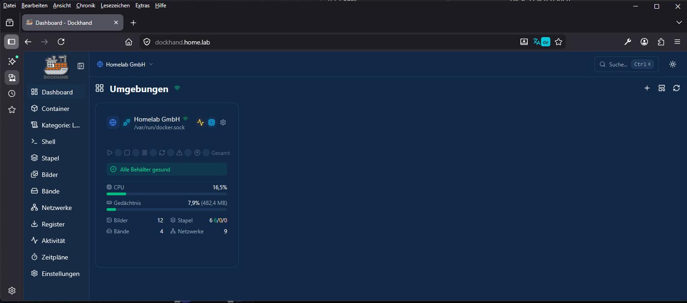

# Dockhand

---

## Inhaltsverzeichnis

- [Voraussetzungen](#voraussetzungen)
- [Struktur](#struktur)
- [.env Datei vorbereiten](#env-datei-vorbereiten)
- [Container starten](#container-starten)
- [DNS-Eintrag setzen](#dns-eintrag-setzen)
- [Funktion testen](#funktion-testen)
- [Fehler beheben](#fehler-beheben)
- [Fertig](#fertig)

Diese Anleitung zeigt dir, wie du Dockhand in deinem Homelab mit PostgreSQL und Traefik bereitstellst, damit der Dienst unter `https://dockhand.home.lab/` erreichbar ist.

---

## Voraussetzungen

- Docker
- Docker Compose
- Einen laufenden Traefik-Container
- Ein vorhandenes Docker-Netzwerk `proxy`
- Zugriff auf dein DNS (oder Router / Pi-hole)

---

## Struktur

```text
/srv/dockhand/
 ├─ compose.yml
 ├─ example.env
 ├─ DOKU.md
 └─ README.md
```

Die Compose-Datei enthält einen PostgreSQL-Container und einen Dockhand-Container mit Traefik-Labels. PostgreSQL läuft im internen Netzwerk, Dockhand zusätzlich im Proxy-Netzwerk.

---

## .env Datei vorbereiten

Benenne zuerst die Beispieldatei um:

```bash
mv example.env .env
```

Öffne danach die Datei:

```bash
nano .env
```

Trage deine Werte ein:

```env
POSTGRES_USER=dockhand
POSTGRES_PASSWORD=dockhandpw
POSTGRES_DB=dockhand
```

Diese Werte werden von PostgreSQL und Dockhand gemeinsam verwendet.

Speichern und schließen.

---

## Container starten

Starte den Stack mit Docker Compose:

```bash
docker compose -f compose.yml up -d
```

Docker erstellt nun:

- den PostgreSQL-Container
- den Dockhand-Container
- das interne Netzwerk
- die Volumes für Datenbank und App-Daten

---

## DNS-Eintrag setzen

Damit du Dockhand über einen Namen erreichst, brauchst du einen DNS-Eintrag.

Beispiel:

```text
dockhand.home.lab → 192.168.178.56
```

Wenn du Pi-hole nutzt:

```text
Settings → Local DNS Records → Eintrag hinzufügen
```

Wichtig ist, dass `dockhand.home.lab` auf den Host zeigt, auf dem Traefik läuft.

---

## Funktion testen

### Weboberfläche öffnen

Öffne im Browser:

```text
https://dockhand.home.lab/
```

Wenn alles richtig konfiguriert ist, sollte Dockhand jetzt erreichbar sein.



---

## Fertig

Dockhand ist jetzt einsatzbereit.

Die Anwendung läuft intern mit PostgreSQL und wird extern über Traefik unter `https://dockhand.home.lab/` veröffentlicht.

---
