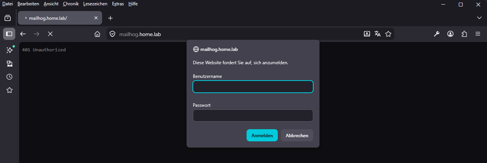
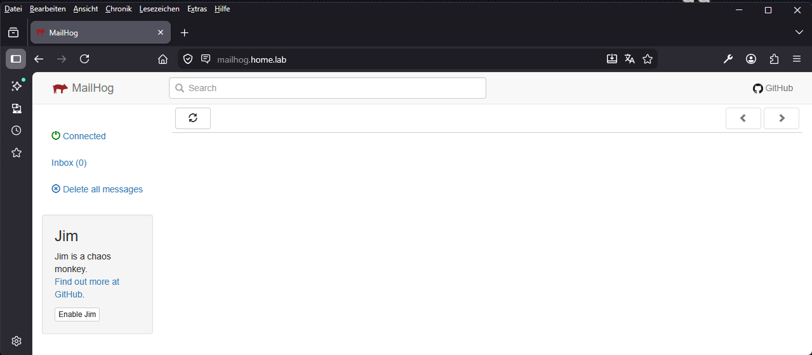
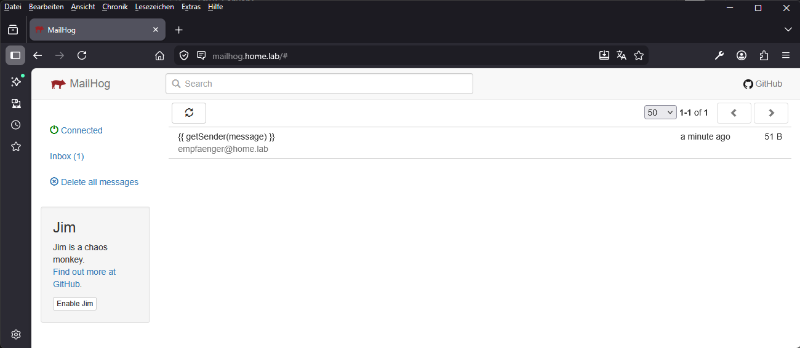
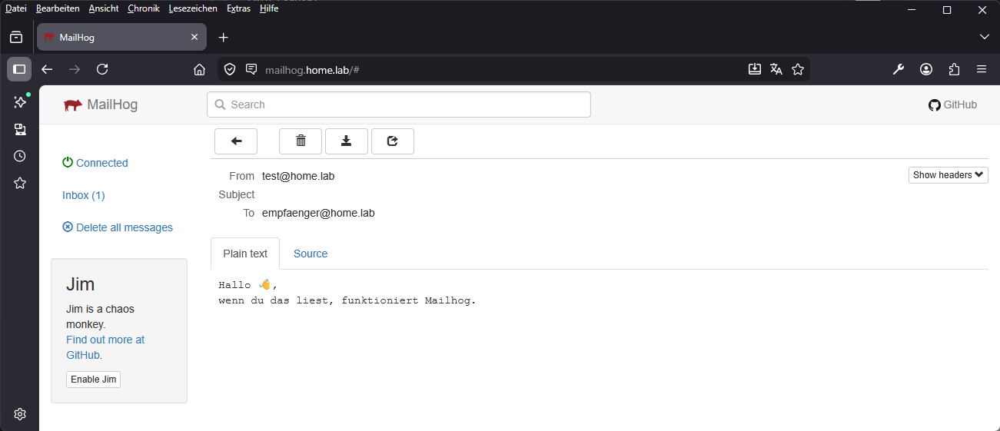

# Mailhog

MailHog ist ein E-Mail-Testwerkzeug, das Entwicklern hilft, E-Mail-Funktionalität zu testen, ohne E-Mails an reale Empfänger senden zu müssen. Es ist ein Open-Source-Projekt, das in der Sprache Go entwickelt und unter der MIT-Lizenz veröffentlicht wurde.

- Github: https://github.com/mailhog/MailHog
- Webpage: https://www.testautomatisierung.org/lexikon/mailhog/

---

## Inhaltsverzeichnis

- [Voraussetzungen](#voraussetzungen)
- [Struktur](#struktur)
- [Passwort erzeugen](#passwort-erzeugen)
- [Passwort für Docker Compose vorbereiten](#passwort-für-docker-compose-vorbereiten)
- [.env Datei anpassen](#env-datei-anpassen)
- [Container starten](#container-starten)
- [DNS-Eintrag setzen](#dns-eintrag-setzen)
- [Funktion testen](#funktion-testen)
- [MailHog in Anwendungen nutzen](#mailhog-in-anwendungen-nutzen)
- [Fertig](#fertig)
- [Test](#test)

---

## Voraussetzungen

- Docker
- Docker Compose
- Einen laufenden Traefik-Container
- Ein vorhandenes Docker-Netzwerk `proxy`
- Zugriff auf dein DNS (oder Router / Pi-hole)

---

## Struktur

```bash
/srv/mailhog/
 ├─ compose.yml
 ├─ DOKU.md
 ├─ README.md
 └─ .env
```

Benenne zuerst die Beispieldatei um:

```bash
mv example.env .env
```

---

## Passwort erzeugen

MailHog wird mit Benutzername und Passwort geschützt.

### Option A — lokal erzeugen

```bash
htpasswd -nb admin meinpasswort
```

### Option B — mit Docker erzeugen

```bash
docker run --rm httpd:2.4-alpine htpasswd -nb admin meinpasswort
```

Du bekommst eine Ausgabe wie diese:

```
admin:$apr1$E8Xxhk8x$XzwhC5QLJnypjscOVv1E7/
```

---

## Passwort für Docker Compose vorbereiten

Docker Compose behandelt das `$`-Zeichen speziell.
Deshalb musst du jedes `$` verdoppeln.

Beispiel:

```
$apr1$E8Xxhk8x$XzwhC5QLJnypjscOVv1E7/
```

wird zu:

```
$$apr1$$E8Xxhk8x$$XzwhC5QLJnypjscOVv1E7/
```

---

## .env Datei anpassen

Öffne die Datei:

```bash
nano .env
```

Trage deine Werte ein:

```
MAILHOG_HOST=mailhog.home.lab
MAILHOG_USER=admin
MAILHOG_PASSWORD_HASH=$$apr1$$E8Xxhk8x$$XzwhC5QLJnypjscOVv1E7/
```

Speichern und schließen.

---

## Container starten

```bash
docker compose up -d
```

Docker lädt nun die Images und startet MailHog im Hintergrund.

---

## DNS-Eintrag setzen

Damit du MailHog über einen Namen erreichst, brauchst du einen DNS-Eintrag.

Beispiel:

```
mailhog.home.lab → 192.168.178.56
```

Wenn du Pi-hole nutzt:

```text
Settings → Local DNS Records → Eintrag hinzufügen
```

Wichtig ist, dass `dockhand.home.lab` auf den Host zeigt, auf dem Traefik läuft.

---

## Funktion testen

### Weboberfläche öffnen

Im Browser:

```
http://192.168.178.56:8025
```

oder

```
https://mailhog.home.lab
```

### Anmeldung

- Benutzername: admin
- Passwort: dein gewähltes Passwort



---

## MailHog in Anwendungen nutzen

SMTP-Server:

```
smtp://mailhog:1025
```

Diesen Server kannst du z. B. in:

- Webanwendungen
- Formularen
- Testumgebungen

als Mailserver eintragen.

---

## Fertig

MailHog ist jetzt einsatzbereit.

Alle gesendeten Testmails erscheinen in der Weboberfläche.



---

## Test

Testmail mit curl senden

```bash
curl -v smtp://mailhog.home.lab:1025 \
  --mail-from "test@home.lab" \
  --mail-rcpt "empfaenger@home.lab" \
  --upload-file - <<EOF
Hallo 👋,
wenn du das liest, funktioniert Mailhog.
EOF
```





---
