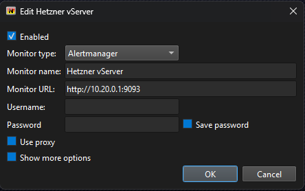
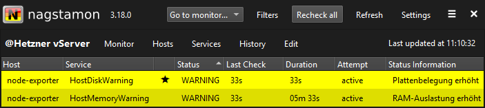
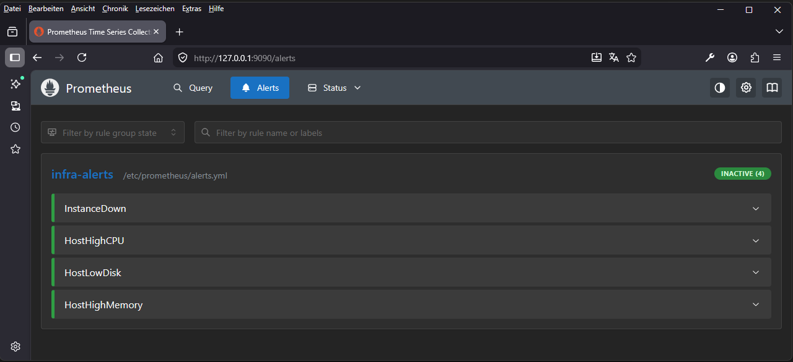
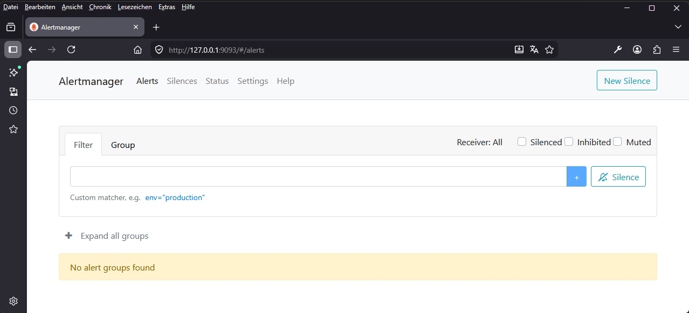
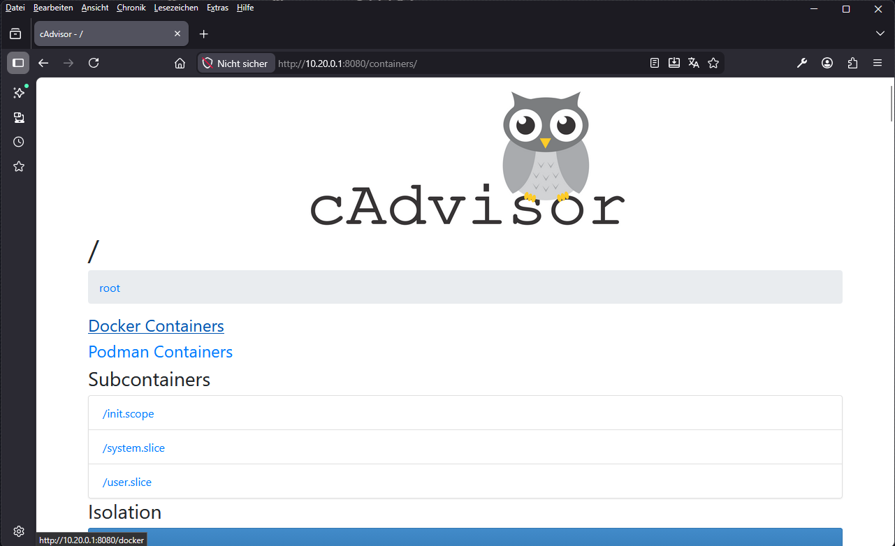
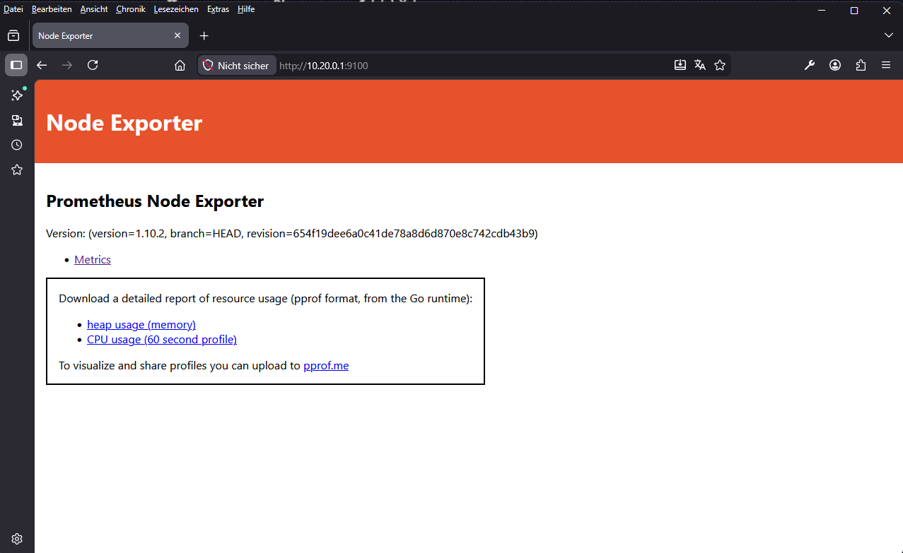

# Monitoring-Stack mit Prometheus, Alertmanager, Node Exporter, cAdvisor und Nagstamon

Dieses Repository dokumentiert ein kompaktes Monitoring-Setup auf Docker-Compose-Basis. Der Stack sammelt Host- und Container-Metriken, wertet Alert-Regeln aus und stellt aktive Alarme über Alertmanager bereit. Zusätzlich kann Nagstamon als schlanke Desktop-Ansicht für Alerts genutzt werden.

Ziel des Repositories ist es, die Konfiguration versionierbar in GitHub zu speichern, damit sie jederzeit nachvollziehbar, wiederverwendbar und auf anderen Servern reproduzierbar bleibt.

---

## Enthaltene Komponenten

- **Prometheus** – sammelt Metriken, speichert Zeitreihen und wertet Alert-Regeln aus
- **Alertmanager** – verarbeitet aktive Alerts und stellt sie übersichtlich dar
- **Node Exporter** – liefert Host-Metriken wie CPU, RAM, Load und Dateisysteme
- **cAdvisor** – liefert Metriken zu laufenden Containern
- **Nagstamon** – externe, kompakte Ansicht für Alerts aus dem Alertmanager
- **Grafana** – optional für Dashboards und Visualisierung

---

## Architektur

Die Überwachung läuft in folgender Kette:

1. **Node Exporter** und **cAdvisor** stellen Metriken bereit.
2. **Prometheus** scraped diese Targets in regelmäßigen Intervallen.
3. **Prometheus** wertet zusätzlich die definierten Regeln aus `alerts.yml` aus.
4. Ausgelöste Alerts werden an den **Alertmanager** gesendet.
5. **Nagstamon** kann diese Alerts direkt aus dem Alertmanager lesen.

Nagstamon ist dabei **kein eigenes Monitoring-System**, sondern eine kompakte Desktop-Ansicht für bereits erzeugte Alerts.

---

## Repository-Struktur

```text
.
├── compose.yml
├── config/
│   ├── prometheus.yml
│   ├── alerts.yml
│   └── alertmanager.yml
├── README.md
├── ssh-tunnel.md
└── screenshots/
    ├── prometheus_alerts.png
    ├── alertmanager.png
    ├── cadvisor.png
    ├── nagstamon_edit.png
    ├── nagstamon_status_ok.png
    └── nagstamon_status_warning.png
```

### Dateien im Überblick

- `compose.yml` – definiert alle Services, Volumes, Netzwerke, Port-Bindings und Healthchecks
- `config/prometheus.yml` – Prometheus-Konfiguration mit Scrape-Jobs, Alerting und Rule-Datei
- `config/alerts.yml` – Alert-Regeln für die Infrastruktur
- `config/alertmanager.yml` – Alertmanager-Konfiguration
- `ssh-tunnel.md` – SSH-Tunnel-Beispiele für den sicheren Zugriff auf die Weboberflächen

---

## Voraussetzungen

Vor dem Start sollten folgende Punkte erfüllt sein:

- Docker und Docker Compose sind auf dem Server installiert
- das externe Docker-Netzwerk `iotnetwork` existiert bereits
- die in `compose.yml` verwendete IP `10.20.0.1` ist im VPN-/WireGuard-Kontext korrekt erreichbar
- für den Remote-Zugriff steht entweder **WireGuard** oder **SSH** zur Verfügung
- Nagstamon ist auf dem Client-System installiert, falls die Desktop-Ansicht genutzt werden soll

---

## Docker-Compose-Setup

Der Stack besteht aus vier Containern:

- `prometheus`
- `alertmanager`
- `node-exporter`
- `cadvisor`

Besondere Merkmale des Setups:

- Konfigurationsdateien werden **read-only** eingebunden
- Prometheus- und Alertmanager-Daten werden in **persistenten Volumes** gespeichert
- alle Container besitzen **Healthchecks**
- die Dienste sind über `restart: unless-stopped` robust konfiguriert
- die Weboberflächen sind an `10.20.0.1` gebunden
- das externe Docker-Netzwerk `iotnetwork` wird genutzt

---

## Starten des Stacks

Container starten:

```bash
docker compose -f compose.yml up -d
```

Status prüfen:

```bash
docker compose -f compose.yml ps
```

Logs prüfen:

```bash
docker logs prometheus
docker logs alertmanager
docker logs node-exporter
docker logs cadvisor
```

---

## Erreichbare Dienste

Bei direktem Zugriff im Netzwerk oder per VPN sind die Dienste unter folgenden Adressen erreichbar:

- **Prometheus**: `http://10.20.0.1:9090`
- **Prometheus Alerts**: `http://10.20.0.1:9090/alerts`
- **Prometheus Rules**: `http://10.20.0.1:9090/rules`
- **Alertmanager**: `http://10.20.0.1:9093/#/alerts`
- **cAdvisor**: `http://10.20.0.1:8080/containers/`
- **Node Exporter**: `http://10.20.0.1:9100/metrics`

Bei lokalem Zugriff über SSH-Tunnel stattdessen:

- **Prometheus**: `http://127.0.0.1:9090`
- **Alertmanager**: `http://127.0.0.1:9093`

---

## Basis-Alerts

Als solide Grundausstattung für Infra-Monitoring eignen sich vor allem folgende Alerts:

- **Host down**
- **wenig freier Speicherplatz**
- **hohe CPU-Auslastung**
- **hohe RAM-Auslastung**

Für Tests können Schwellen niedriger gesetzt werden, z. B. Warning bei 70 % und Critical bei 80 %.

Wichtig:

- `PENDING` bedeutet: Bedingung ist wahr, aber `for:` ist noch nicht abgelaufen
- `FIRING` bedeutet: der Alert ist aktiv und erscheint im Alertmanager bzw. in Nagstamon
- ein Alert verschwindet wieder, sobald die Bedingung nicht mehr erfüllt ist und Prometheus die Regel erneut auswertet

---

## Änderungen an der Konfiguration

### Prometheus- oder Alert-Regeln anpassen

Wenn `config/prometheus.yml` oder `config/alerts.yml` geändert wurden:

```bash
docker restart prometheus
```

### Alertmanager-Konfiguration anpassen

Wenn `config/alertmanager.yml` geändert wurde:

```bash
docker restart alertmanager
```

---

## Test-Checkliste

Nach der Inbetriebnahme empfiehlt sich folgende kurze Prüfung:

1. Container laufen
2. Healthchecks sind erfolgreich
3. Targets in Prometheus sind `UP`
4. Regeln werden in Prometheus angezeigt
5. Alerts erscheinen im Alertmanager
6. Nagstamon kann den Alertmanager lesen

Wichtige URLs für den Test:

- `http://127.0.0.1:9090/rules`
- `http://127.0.0.1:9090/alerts`
- `http://127.0.0.1:9093/#/alerts`

---

## Nagstamon einrichten

Nagstamon wird nicht als Container in diesem Stack betrieben, sondern extern auf dem Client-System verwendet. Es verbindet sich mit dem Alertmanager und zeigt aktive Alerts in kompakter Form an.

### Voraussetzungen für Nagstamon

Vor der Einrichtung sollte der Monitoring-Stack bereits laufen:

- Prometheus erreichbar
- Alertmanager erreichbar
- Regeln geladen
- mindestens ein Test-Alert oder echter Alert funktionsfähig

### Neuer Server in Nagstamon

In Nagstamon einen neuen Server anlegen:



- **Enabled**: aktivieren
- **Monitor type**: `Alertmanager`
- **Monitor name**: frei wählbar, z. B. `Hetzner vServer`
- **Monitor URL**:
  - `http://127.0.0.1:9093` bei SSH-Tunnel
  - `http://10.20.0.1:9093` bei direktem WireGuard-/VPN-Zugriff
- **Username**: leer lassen
- **Password**: leer lassen
- **Save password**: deaktiviert lassen, wenn keine Authentifizierung verwendet wird
- **Use proxy**: deaktiviert lassen

Danach sollte Nagstamon die aktiven Alerts aus dem Alertmanager anzeigen.

### Status-Anzeige in Nagstamon




- **OK** – aktuell keine aktiven Alerts
- **WARNING** – mindestens ein Alert mit `severity: warning`
- **CRITICAL** – mindestens ein Alert mit `severity: critical`

### Verhalten der Alerts

- Ein Alert erscheint in Nagstamon in der Regel erst, wenn er in Prometheus von `PENDING` auf `FIRING` gewechselt ist.
- `for: 5m` bedeutet also: Bedingung muss 5 Minuten lang erfüllt sein, bevor der Alert als aktiv gilt.
- Fällt der Messwert wieder unter die Schwelle, verschwindet der Alert nach der nächsten Auswertung durch Prometheus wieder.

### Beispiel-Tests

Zum schnellen Testen können Alert-Schwellen absichtlich niedrig gewählt werden, zum Beispiel:

- CPU Warning ab 70 %
- CPU Critical ab 80 %
- Memory Warning ab 70 %
- Memory Critical ab 80 %
- Disk Warning ab 70 %
- Disk Critical ab 80 %
- Down Warning nach kurzer Zeit
- Down Critical nach längerer Zeit

---

## SSH-Tunnel oder WireGuard

Für den Zugriff gibt es zwei sinnvolle Wege:

### 1. WireGuard / VPN

Wenn der Client im VPN ist, können die Dienste direkt über die interne IP `10.20.0.1` erreicht werden. Das ist für den Alltag meist die bequemste Lösung.

### 2. SSH-Tunnel

Wenn kein direkter VPN-Zugriff besteht, kann stattdessen ein lokaler Tunnel aufgebaut werden.

Beispiel mit zwei Tunneln gleichzeitig:

```bash
ssh -L 9090:127.0.0.1:9090 -L 9093:127.0.0.1:9093 user@34.123.456.12
```

Danach lokal erreichbar:

- Prometheus: `http://127.0.0.1:9090`
- Alertmanager: `http://127.0.0.1:9093`

Die ausführliche, eigenständige Anleitung liegt in [SSH-TUNNEL-SETUP](./ssh-tunnel-setup.md).

---

## Screenshots

### Prometheus



### Alertmanager



### cAdvisor



### Node-Exporter



---

## Hinweise

- Die Port-Bindings sind bewusst auf `10.20.0.1` eingeschränkt und nicht global veröffentlicht.
- Für produktive Setups sollte der Zugriff zusätzlich durch Firewall, VPN oder Reverse Proxy abgesichert werden.
- Die Dokumentation ist bewusst pragmatisch gehalten und kann später leicht um Benachrichtigungswege wie E-Mail, Webhooks oder Silences erweitert werden.
