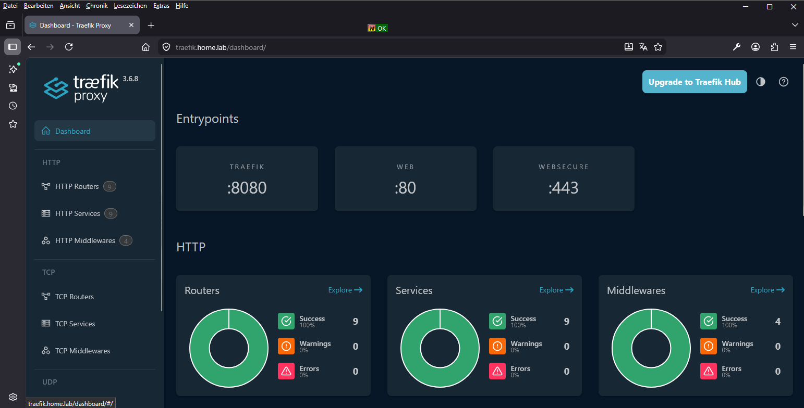
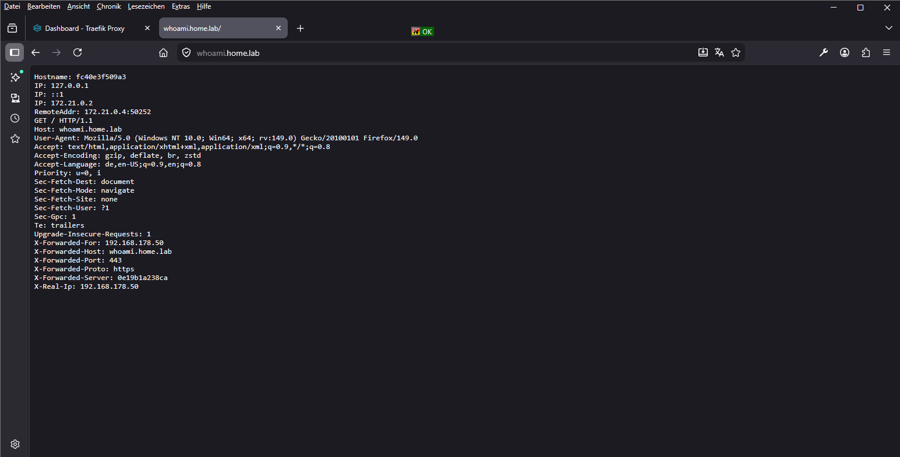

# Traefik Home Lab

Dieses Repository dokumentiert mein Traefik-Setup im Homelab.  
[Traefik](https://traefik.io/traefik) läuft als Docker-Container und übernimmt:

- Reverse Proxy für interne Dienste
- HTTPS-Terminierung
- automatische Zertifikatsausstellung über step-ca
- Docker-basierte Service-Erkennung

---

## Verzeichnisstruktur

- `compose.yml` – Container-Definition
- `traefik.yml` – statische Traefik-Konfiguration
- `.env.example` – Beispiel für lokale Umgebungsvariablen
- `acme/` – ACME-Speicher
- `certs/` – Root-CA / Zertifikate für step-ca Vertrauen

## Voraussetzungen

- Docker
- Docker Compose
- externes Docker-Netzwerk `proxy`
- erreichbare step-ca Instanz
- Root-CA von step-ca `root_ca.crt`

## Externes Docker-Netzwerk

Wenn das Netzwerk noch nicht existiert, muss es einmalig erstellt werden, damit andere Container im selben Docker-Netzwerk mit Traefik kommunizieren können.

```bash
docker network create proxy
```

---

## Einrichtung der `.env`

Die Beispiel-Datei kopieren:

```bash
cp .env.example .env
```

Danach die Werte in der .env anpassen:

```text
TRAEFIK_DASHBOARD_HOST=traefik.home.lab
WHOAMI_HOST=whoami.home.lab
ACME_EMAIL=admin@home.lab
STEP_CA_ACME_URL=https://stepca.home.lab:9000/acme/acme/directory
```

## Root-CA bereitstellen

Damit Traefik Zertifikate über `step-ca` anfordern kann, muss der Container der internen Root-CA vertrauen.

Die `step-ca` verwendet ein eigenes Root-Zertifikat, das in einem normalen Container nicht automatisch bekannt ist.  
Deshalb muss `root_ca.crt` lokal unter folgendem Pfad abgelegt werden:

```bash
/srv/traefik/certs/root_ca.crt
```

Dieses Zertifikat wird in den Container eingebunden und über `LEGO_CA_CERTIFICATES` verwendet.

Dadurch kann Traefik die ACME-Schnittstelle von `step-ca` sicher erreichen und ihr vertrauen.
Ohne diesen Schritt schlagen Zertifikatsanforderungen in der Regel wegen eines TLS-/CA-Vertrauensfehlers fehl.

## Traefik starten

```bash
docker compose up -d
```

Logs prüfen:

```bash
docker logs traefik
```

---

## Optionaler Testdienst whoami

Der Container `whoami` dient nur zum Testen von Routing, DNS und Zertifikaten.
Er ist für den Betrieb von Traefik nicht zwingend erforderlich und kann bei Bedarf entfernt oder später durch eigene Dienste ersetzt werden.

> **Hinweise**
>
> - Die Datei acme/acme.json wird von Traefik automatisch erzeugt.
> - Die Hostnamen müssen per lokalem DNS oder Hosts-Datei auf den Traefik-Server zeigen.
> - Das Dashboard ist über traefik.home.lab erreichbar.
> - whoami.home.lab dient als Testservice für Routing und Zertifikate.

---

### Traefik Dashboard



### Whoami Test Page


